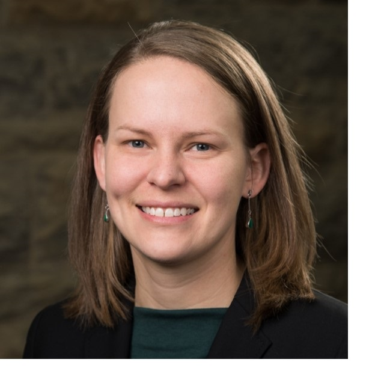

My name is Kait (she/her), and I am an ecologist and educator. In my work as the undergraduate ecology lab coordinator at the [Odum School of Ecology](http://ecology.uga.edu/) at the University of Georgia, I develop   hands-on lab activities to engage both science majors and non-majors with ecological concepts and skills. You can learn more about the courses I teach and coordinate on the [Teaching](https://farrellkj2.github.io/teaching.html) tab.    

My research background is in freshwater ecosystem ecology. I earned my Ph.D. in Ecology in May 2017 from the University of Georgia, and from 2017-2019, I was a postdoctoral associate at Virginia Tech, where I worked on lake modeling and developing teaching modules to bring "big data" concepts into undergraduate ecology classes. To learn about my previous research, please visit my [Research](https://farrellkj2.github.io/research.html) and [Publications](https://farrellkj2.github.io/pubs.html) pages.  

 
 

****

Webpage devloped using [rmarkdown website template](https://github.com/privefl/rmarkdown-website-template){target="_blank"} developed by [privefl](https://github.com/privefl){target="_blank"}