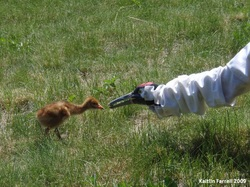
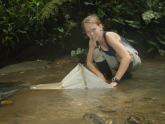
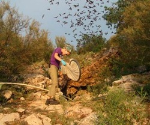

```{r setup, include=FALSE}
knitr::opts_chunk$set(echo = TRUE)
```

# Postdoctoral Research

As a postdoc at Virginia Tech, I worked on a number of collaborative projects related to lake biogeochemistry. In a collaboration between computer scientists and limnologists through the [PRAGMA-GLEON expedition](http://www.pragma-grid.net/projects/lake/), I modeled how nitrogen and phosphorus cycling in a eutrophic lake and oligotrophic lake may respond differently to climate warming [(Farrell et al. 2020)](https://www.sciencedirect.com/science/article/pii/S0304380020302064). I also contributed to a multidisciplinary Coupled Natural Human Systems project- [CNH-Lakes](https://www.cnhlakes.frec.vt.edu/) [(Cobourn et al. 2018)](https://esajournals.onlinelibrary.wiley.com/doi/abs/10.1002/ecs2.2209)- where I helped link models of lake water chemistry and economics to explore how water clarity and phytoplankton blooms affect properly values near lakes [(Weng et al. 2020)](https://www.sciencedirect.com/science/article/pii/S0921800919304549?via%3Dihub).

In addition, I worked with Cayelan Carey to develop [Macrosystems EDDIE](https://serc.carleton.edu/eddie/macrosystems/index.html)- a curriculum of teaching modules that help introduce undergraduate students to macrosystems ecology concepts through the use of simulation modeling and R [(Farrell & Carey 2018)](https://onlinelibrary.wiley.com/doi/abs/10.1002/ece3.4363).

# PhD Research

My PhD research was part of the **S**cale, **C**onsumers, **A**nd **L**otic **E**cosystem **R**ates (SCALER) project, which was a collaborative Macrosystems biology project that has included headwater stream networks in five biomes across North America (tropical forest, temperate mountainous forest, prairie, northern boreal evergreen forest, & tundra), with the goal of determining how small-scale ecological experiments be applied to understand patterns and processes at the ecosystem scale [(Rüegg et al. 2016;](https://www.fs.usda.gov/treesearch/pubs/download/52440.pdf)[ Song et al. 2018)](https://www.nature.com/articles/s41561-018-0125-5).

My research was focused on quantifying linkages between structure and function in headwater stream networks, with field work based out of the Coweeta Hydrologic Lab in Macon County, North Carolina (USA). I was particularly interested in understanding how the removal of large aquatic consumers (salamanders, crayfish, fishes) changed rates of stream metabolism and nutrient uptake, because understanding how organism losses affect stream processes could help predict stream responses to environmental disturbance and biodiversity loss. In addition, I asked questions about how aquatic food webs, in terms of primary and secondary consumers, and the basal resources they feed upon, change along stream networks [(Farrell et al. 2018)](https://link.springer.com/article/10.1007/s10021-018-0247-z).

# GLEON Fellowship

As a member of the 2nd cohort of the Global Lakes Ecological Observatory Network (GLEON) Fellowship Program (2015-2017), I gained hands-on experience in both interdisciplinary team science & macrosystems biology. Our working groups focused on:  

1. documenting long-term trends in salt concentrations in lakes [(Dugan et al. 2017)](https://www.pnas.org/doi/full/10.1073/pnas.1620211114) and    

2. developing simple dynamic models for organic carbon cycling in lakes [(McCullough et al. 2018)](https://doi.org/10.1016/j.ecolmodel.2018.08.009). 

# Earlier Projects
### Crayfish/Branchiobdellid Symbiosis Research

While pursuing my Master's degree, I studied aspects of the cleaning symbiosis between crayfish (*Cambarus* spp.) and branchiobdellid worms (Annelida: Branchiobdellidae). My research specifically sought to determine why two co-existing crayfish (*Cambarus chasmodactylus* and *Orconectes cristavarius*) differ in the number of worms (*Cambarincola ingens*) they host.

Collaborators: Dr. Robert Creed; Dr. Bryan Brown; Dr. James Skelton

### Whooping Crane Direct Autumn Release Internship

Working in collaboration with the International Crane Foundation and the US Fish & Wildlife Service, I spent 6 months (2009) in Baraboo and Necedah, WI isolation-rearing whooping crane chicks for release.     
     
    

### Tropical Stream Independent Research

As an undergraduate, I designed and conducted a 5-month (2008) field study on macroinvertebrate communities in Ecuadorian tropical forest streams. Based out of the Estación Biológica Bilsa in northwestern Ecuador, I examined whether the forest type (primary forest vs. secondary regrowth) adjacent to perennial streams affected aquatic macroinvertebrate community structure and diversity.

### Boston University Bat Lab Summer Research Assistant

I spent the summer of 2006 assisting [Louise Allen](https://www.linkedin.com/in/louise-allen-37b3214b/) (PhD, Boston U.) with her dissertation research on Brazilian free-tailed bats (*Tadarida brasiliensis*). Research was conducted near Austin, TX through the BU Bat Lab. 
