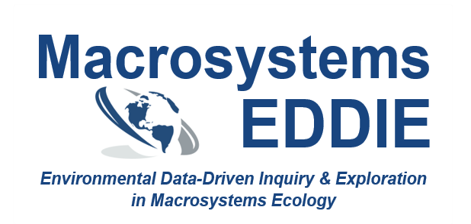

```{r setup, include=FALSE}
knitr::opts_chunk$set(echo = TRUE)
```
# Course Development & Instruction
## Large-Enrollment Lab Courses
*Fall, Spring, and Summer semesters since Fall 2019* 

As the undergraduate lab coordinator for the Odum School of Ecology, I develop activities for, and coordinate graduate teaching assistants' instruction of, our large-enrollment lab courses. Labs enroll over 1200 students per year.

* Ecological Basis of Environmental Issues (**ECOL 1000L**): An introductory, non-majors lab that introduces students to core concepts in ecological principles and how human activities affect the environment. Throughout the semester, students practice communicating about scientific information, visualizing data, and critically evaluating moral and ethical issues associated with the environmental challenges we face.

* Ecology Lab (**ECOL 3500L**) and Ecology Lab- Honors (**ECOL 3505L**): An upper-level lab for STEM majors that reinforces concepts from the co-requisite ecology lecture using hands-on activities. Students also regularly practice communicating scientific knowledge, analyzing and visualizing data, and designing and implementing ecological field studies.

## Interdisciplinary Field Program
*Summer 2016, Summer 2018-present*  

The UGA Interdisciplinary Field Program ([IFP](https://ifp.uga.edu/)) is an 8-week cross-country "summer semester on wheels" in which students are enrolled in concurrent geology, anthropology, and ecology courses. As an ecology instructor, I develop and teach place-based lessons for two courses: 

* Ecological Basis of Environmental Issues- Honors section + lab (**ECOL 1000H & 1000L**)

* Ecology of North America (**ECOL 4160**)

## Additional Courses
* Graduate Teaching Seminar (**GRSC 7770**): Each fall since 2019, I teach a course for first-time graduate teaching assistants in ecology and related disciplines. The course focuses on implementing evidence-based teaching practices, developing lessons using backward design principles, and inclusive and reflective teaching.

* Ecology Senior Seminar (**ECOL 4950**): Since Spring 2020, I have taught the capstone seminar course for undergraduate Ecology majors at UGA. The seminar focuses on student-led discussions of cutting-edge topics in the ecological literature, and communicating their ecological expertise by [editing Wikipedia pages](https://wikiedu.org/blog/2021/06/08/sharing-ecological-expertise-through-wikipedia/).  

* Ecology Research Lab (**ECOL 3510**): In Summer 2021, I designed and taught a course-based undergraduate research experience (CURE) to immerse students in the process of conducting ecological research. Activities focused on student-driven research using publically-available datasets from the National Ecological Observatory network ([NEON](https://www.neonscience.org/)), as well as implementing best practices in collaborative and reproducible research. 

### Graduate Teaching Assistantships
* Freshwater Ecosystems Lab: In Fall 2015 and 2016, I taught hands-on labs to collect and analyze data from local lakes and streams. As part of my teaching assistantship, I restructured the student lab manual and developed a teaching assistant manual. 

* Ichthyology Lab: In Fall 2014, I taught labs that focused on inquiry-based explorations of fish taxonomy, morphology, and ecology using preserved specimens. As part of that role, I also developed a student lab book for use in subsequent semesters.

# Macrosystems EDDIE

As part of my postdoctoral work, I helped develop the first four teaching modules in the [Macrosystems EDDIE](www.MacrosystemsEDDIE.org) (Environmental Data-Driven Inquiry & Exploration) project. These flexible, ready-to-use modules can be used alone or as a series to bring macrosystems ecology concepts and simulation modeling into undergraduate science classes.

As part of module development, we assessed how effectively each module achieved desired learning outcomes through volunteer classrooms whose students completed paired pre- and post-module assessments.

Key findings include:

* Working with hands-on modules helps build students' computational literacy and empower students with the skills to ask complex ecological questions (Farrell & Carey 2018)

* Macrosystems EDDIE modules increased students' proficiency & confidence working with ecosystem models and their use of systems thinking (Carey et al. 2020)

* Macrosystems EDDIE modules increased students'ability to define, interpret, and apply key concepts in macrosystems ecology (Hounshell et al. 2021)

# Pedagogical Training
## Teaching Certificate
While pursuing my PhD, I also completed the University of Georgia [Interdisciplinary Certificate in University Teaching](https://grad.uga.edu/index.php/current-students/professional-development/university-teaching/) (2017). 

As part of that program, I completed 9 hours of coursework in pedagogy and course design:  

* Graduate Seminar for Teaching and Laboratory Assistants (GRSC 7770), Fall 2013  

* Designing Courses for Significant Learning (GRSC 7900), Fall 2014   

* Using Technology in the College Classroom (EDHI 9040), Spring 2015


I also designed and carried out scholarship of teaching and learning (SoTL) study, "Assessing student preparedness for writing in the sciences", to assess how prepared upper-level undergraduate and first-semester graduate students were for writing scientific-style reports.

Through a combination of pre- and post-assignment student surveys, I assessed whether student perceptions of their preparedness matched their performance on writing assignments, and if not, if and how I could develop scaffolding activities to improve their writing outcomes. 

I presented the results of my project at the 2016 University System of Georgia Teaching and Learning Conference in Athens, GA.

# Teaching Awards & Recognition 
* 2021: Dean’s Award, Odum School of Ecology, University of Georgia  
  + Given "to honor professional achievement and outstanding creativity and innovation in service, research or teaching"

* 2021	Outstanding Faculty Instructor of the Year, Odum School of Ecology, University of Georgia  
  + "Farrell was honored for exceptional creativity and care in coordinating the pivot of ecology’s instructional laboratory program to online and hybrid format this past year, and for outstanding curricular development and mentoring of graduate student teaching assistants in ecology" ([OSE News](https://www.ecology.uga.edu/odum-school-2021-spring-fling/))

* 2017: Ecology Nominee, Excellence in Teaching Award, University of Georgia  

* 2016: Outstanding Teaching Assistant Award, University of Georgia

* 2016: Distinguished Graduate Student Teaching Award, Odum School of Ecology, University of Georgia